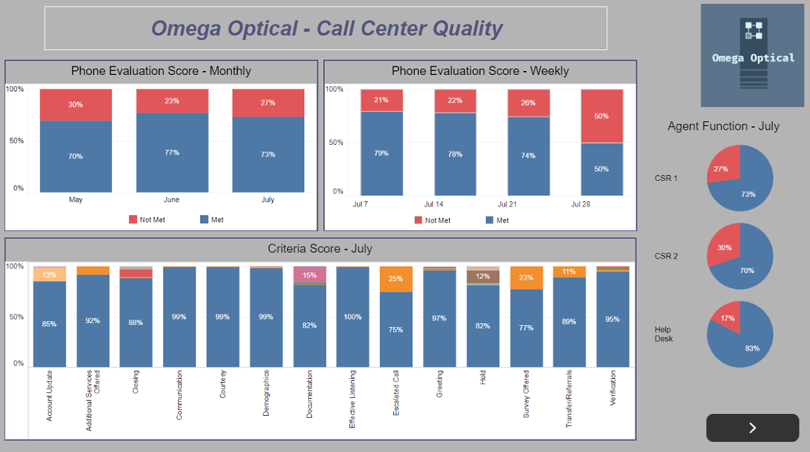
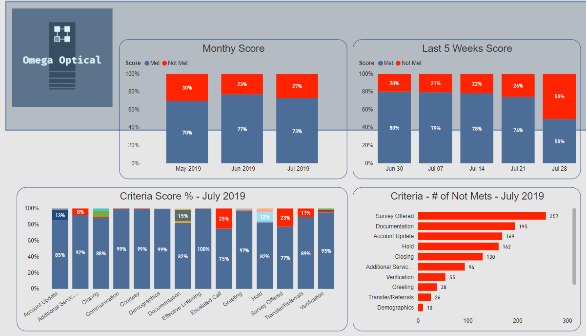

# Omega Optical

## Goal
The goal of this project is to take customer service data, call center agent score cards, and display relevant information in Power BI and Excel reports. Dataset includes 3 months' worth of phone evaluations with multiple evaluations per agent and over 14 different scoring criteria.

## Tools Used

* **Excel** for capturing data and displaying data via a dashboard
* **Tableau** for data visualization
* **Power BI** for data visualization

<<<<<<< HEAD:README.txt
[Click Here](https://public.tableau.com/profile/clanton#!/vizhome/OmegaOpticalQualityDashboard/Dashboard1) to view my Tableau dashboard

=======
>>>>>>> 2739709660df4a600e5c7dec2213b596984c91d4:README.MD
## Project Screenshots

### Tableau Dashboard

### Power BI Dashboard

